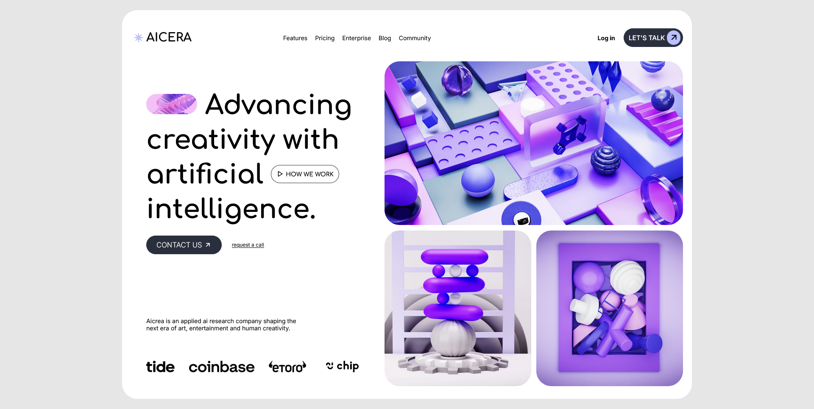

# 🌟 AICERA - Bento Grid Landing Page

A modern **bento-style landing page** built for an **AI & creativity-focused brand**.
This project showcases a clean, high-end **product marketing layout** using **CSS Grid**, **SCSS**, and **strong visual storytelling** inspired by contemporary AI startups and design-forward SaaS websites.

The layout blends **typography**, **imagery**, and spacing to communicate innovation, trust, and creativity in a single-screen experience.
---

## ✨ Features

- 🧱 **Bento grid layout** using CSS Grid
- 🎨 **Minimal, premium UI** inspired by AI & SaaS landing pages
- 🖼️ **Large visual panels** with editorial-style imagery
- 🧠 **Brand-focused hero message** with CTA integration
- 🧭 **Navigation bar** with logo, links, and action buttons
- 🪟 **Rounded cards & soft spacing** for modern aesthetics
- 🧩 **SCSS architecture** with variables, nesting, and scale ratios
- 🖱️ **Hover-ready interactive elements** (buttons & links)

---

## 🌐 Live Demo / Review

You can view and interact with the project here:  
👉 [AICERA - Bento Grid Landing Page Live Demo](https://harsh-codes-hub.github.io/Bento-grid-layout-TASK8/)

Experience a clean, editorial-style AI landing page with balanced content blocks and visual flow.

---

## 🗂️ File Structure
```bash
bento-grid-layout-task8/
│
├── index.html        # Main HTML structure
├── style.css         # Compiled CSS (from SCSS)
├── style.scss        # SCSS code containing all Styles
│
├── /fonts/           # Custom variable fonts
│   ├── Inter-VariableFont.woff2
│   └── Comfortaa-VariableFont.woff2
│
├── /images/          # Brand & sponsor images
│   ├── tide.png
│   ├── coinbase.png
│   ├── etoro.png
│   └── Chip.png
│
├── /favicon/         # Website icons & manifest
│   ├── favicon-16x16.png
│   ├── favicon-32x32.png
│   ├── apple-touch-icon.png
│   └── site.webmanifest
│
├── preview.webp      # Preview image of the page
│
└── README.md         # Project documentation

```

---

## 💻 Usage

1. **Clone the repository:**
   ```bash
   git clone https://github.com/Harsh-Codes-hub/Bento-grid-layout-TASK8.git
   ```
2. **Navigate to the project directory:**
   ```bash
   cd Bento-grid-layout-TASK8
   ``` 
3. *Open the project in your browser*
   ```
   open index.html
   ```
   or simply double-click on **index.html**

---

## 🧠 Learning Highlights

- 🧱 Built a **complex bento grid layout** using `grid-template-columns` and `grid-template-rows`
- 🎨 Used **SCSS variables** for color systems, fonts, and spacing scales
- 📐 Implemented design ratios (`--gr`) for consistent typography scaling
- 🪟 Practiced **nested SCSS structure** for maintainable styling
- 🧭 Learned **content placement strategy** for landing page storytelling
- 🖼️ Balanced **text-to-image hierarchy** for premium **UI design**
- 🧠 Explored how **AI branding aesthetics** differ from generic layouts

---

## 🧠 What Makes This Project Special

- 🧠 Designed specifically for **AI & creativity-driven branding**
- 🧱 **Editorial bento grid** instead of traditional hero + sections
- 🎨 Strong focus on **typography, spacing, and rhythm**
- 🪟 Rounded containers that feel modern and product-focused
- 🖼️ Image blocks act as **visual anchors**, not decoration
- ⚡ Clean, fast, and framework-free
---

## 📸 Preview

*AICERA Bento Grid Landing Page — showcasing navigation, hero message, imagery, and sponsor section.*



---

## 🛠️ Built With

- 🧾 **HTML5**
- 🎨 **CSS3**
- 🧩 **CSS Grid & Flexbox**
- 🔤 **Custom Variable Fonts**
- 🖼️ **Unsplash imagery**
- 🎯 **Modern UI / SaaS design principles**

---

## 👨‍💻 Author

**Cohort 2.0 – Batch Task 8 Submission**  
Created by **Harsh Gajrani** _(Harsh Codes Hub)_  
Part of the **Cohort 2.0 batch at Sheryians Coding School**

Part of frontend design practice & layout exploration
Focused on **bento grids, branding-driven layouts, and modern UI systems**

---

*⭐ If you like modern landing pages, bento layouts, or AI-inspired UI design, feel free to star the project and explore further iterations.*

---
